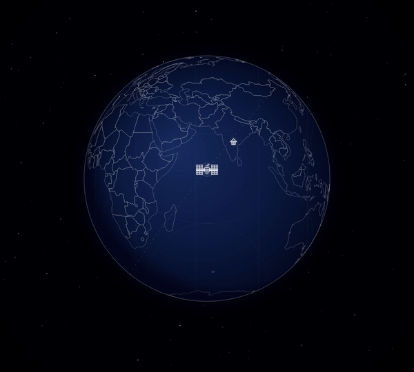

# ISSCast

**Live ISS tracking wallpaper for Windows.**

ISSCast sets your desktop wallpaper to a real-time map of the International Space Station — updated every 10 seconds. Watch the ISS orbit the Earth, track its path over your location, and see live crew and telemetry data, all without opening a single app.

---

## Features

- **Live ISS position** on a 3D orthographic globe, centered on the satellite
- **Orbital path** — spherically correct ground track drawn in real time
- **Day / Night terminator** — accurate shadow overlay based on current solar position
- **Home location marker** — see exactly where the ISS is relative to you
- **Live data panel** — speed, altitude, coordinates, and crew count
- **System tray** — runs silently in the background, no open windows
- **Auto-start** — launches with Windows after first install

---

## Download

👉 **[ISSCast Setup 1.0.0.exe](https://github.com/king1484/iss-cast/releases/download/v1.0.0/ISSCast%20Setup%201.0.0.exe)** (~82 MB)

---

## Installation

1. Download the installer above
2. Run it — if Windows SmartScreen appears, click **More info → Run anyway**
3. On first launch, type your city name to set your home location
4. Done — your wallpaper updates live every 10 seconds

**Requirements:** Windows 10 or 11, internet connection

---

## Notes

- ISS data is sourced from [open-notify.org](http://open-notify.org/).
- To uninstall: Settings → Apps → ISSCast → Uninstall
